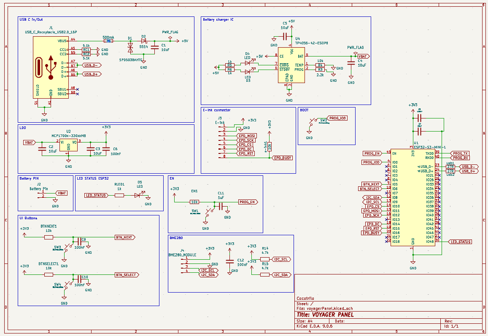
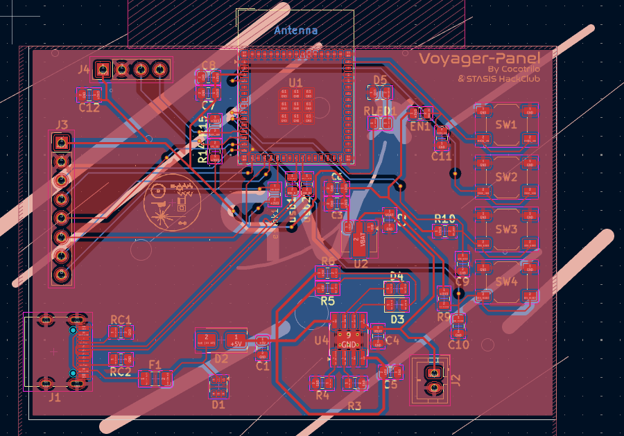
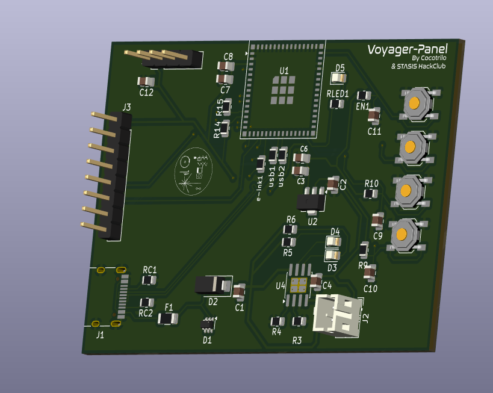
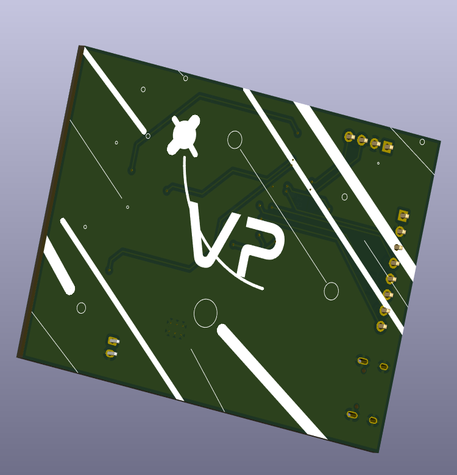

# Voyager-Panel
An E-Ink travel dashboard. with an ESP32-S3 Showing weather, hackclub countdowns, and travel info for hackactons. this dashboard has Low-Power consumption, Wi-Fi connected, battery-operated!!!!

## The reason behind this project
This project started form the *dream* of always wanting to have a big countdown telling you the Narrow door for a better future is closing, yeah crazy right?, hahaha well actually this project started in the supermarket of my local city, I was shopping and noticed an E-Ink display, I thought *I have seen this before* and it was when I was searching my first project I saw something called E-Ink dashboard, and was cool but I thought Im too newbie for this, so I challenged myself to improve my PCB designer skills and I think I did a really cool project, im really proud of it tbh, well but in the end the actual big reason is to truly have a giant countdown telling you stasis is over in X days or telling you your youth days are over in X days I love presure >:D

## Schematic Overview

## PCB - DIFERENT VERSIONS

## RENDER!!

## BOM
| Name | Purpose | Qty | Cost (USD) | Distributor
|-----:|----------|----------|-------|-------|

## Final notes!
Thanks for reading! made possible with http://stasis.hackclub.com/

## me
*By cocotrilo*
**made with luv (THIS ONE was with a lot of love, EXCEPT FOR THE BOM PLEASE DONT USE EVER ALIEXPRESS) Nk but luv from EC <3**
