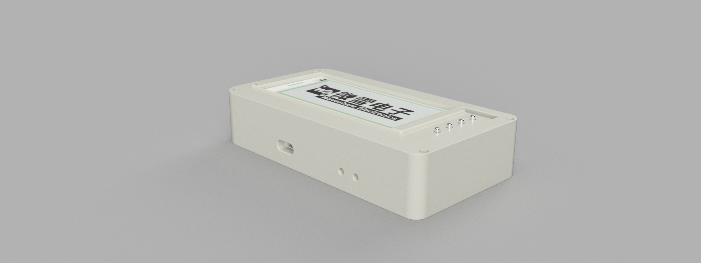

# Voyager-Panel
An E-Ink travel dashboard. with an ESP32-S3 Showing weather, hackclub countdowns, and travel info for hackactons. this dashboard has Low-Power consumption, Wi-Fi connected, battery-operated!!!!

## The reason behind this project
This project started form the *dream* of always wanting to have a big countdown telling you the Narrow door for a better future is closing, yeah crazy right?, hahaha well actually this project started in the supermarket of my local city, I was shopping and noticed an E-Ink display, I thought *I have seen this before* and it was when I was searching my first project I saw something called E-Ink dashboard, and was cool but I thought Im too newbie for this, so I challenged myself to improve my PCB designer skills and I think I did a really cool project, im really proud of it tbh, well but in the end the actual big reason is to truly have a giant countdown telling you stasis is over in X days or telling you your youth days are over in X days I love presure >:D

## Schematic Overview

## PCB - DIFERENT VERSIONS

## RENDER!!

## BOM
| Name | Purpose | Qty | Cost (USD) | Distributor |
|------|---------|-----|-----------|-------------|
| ESP32-S3-MINI-1 | Main microcontroller with WiFi and USB native | 1 | $8.50 | AliExpress |
| Waveshare 2.9inch e-Paper Module | Main e-ink display 296x128px | 1 | $17.00 | AliExpress |
| BME280 Breakout Module | Temperature/Humidity/Pressure sensor | 1 | $5.15 | AliExpress |
| LiPo Battery 1000mAh 3.7V | Portable power source | 1 | $5.00 | Local Ecuador |
| USB-C Receptacle 16P | Power input and native USB programming | 1 | $0.50 | JLCPCB |
| JST PH 2mm 2-Pin Connector | Battery connector | 1 | $0.10 | JLCPCB |
| Pin Header 1x08 2.54mm | E-ink display connector | 1 | $0.05 | Local |
| Pin Header 1x04 2.54mm | BME280 module connector | 1 | $0.05 | Local |
| TP4056-42-ESOP8 | LiPo battery charger IC | 1 | $0.15 | JLCPCB |
| MCP1700-3302 SOT-89 | 3.3V LDO regulator 0.2V dropout | 1 | $0.45 | JLCPCB |
| SP0503BAHTG SOT-363 | TVS ESD protection diode for USB | 1 | $0.20 | JLCPCB |
| SS14 SMA | Schottky diode reverse current protection | 1 | $0.05 | JLCPCB |
| Polyfuse 500mA 1206 | Resettable overcurrent fuse | 1 | $0.10 | JLCPCB |
| SW_SPST_TL3342 | Tactile buttons Reset/Boot/Next/Select | 4 | $0.05 | JLCPCB |
| LED 0805 Red | Battery charging indicator CHRG | 1 | $0.02 | JLCPCB |
| LED 0805 Blue | Standby indicator STDBY | 1 | $0.02 | JLCPCB |
| LED 0805 Green | System status indicator | 1 | $0.02 | JLCPCB |
| Resistor 1k 0805 | LED current limiting resistors | 3 | $0.03 | JLCPCB |
| Resistor 2.2k 0805 | TP4056 charge current set 550mA | 1 | $0.01 | JLCPCB |
| Resistor 4.7k 0805 | I2C SDA/SCL pull-up resistors | 2 | $0.02 | JLCPCB |
| Resistor 5.1k 0805 | USB-C CC1/CC2 pull-down resistors | 2 | $0.02 | JLCPCB |
| Resistor 10k 0805 | Pull-ups for EN/BOOT/UI buttons | 5 | $0.05 | JLCPCB |
| Resistor 27R 0805 | USB D+/D- series termination | 2 | $0.02 | JLCPCB |
| Capacitor 100nF 0805 | High frequency decoupling | 5 | $0.05 | JLCPCB |
| Capacitor 1uF 0805 | EN pin reset debounce | 1 | $0.02 | JLCPCB |
| Capacitor 10uF 0805 | Bulk decoupling capacitors | 5 | $0.15 | JLCPCB |
| Capacitor 22uF 0805 | ESP32 main power bulk decoupling | 1 | $0.05 | JLCPCB |
| PCB + SMT Assembly | 2-layer PCB with PCBA | 1 | $47.90 | JLCPCB |
| **TOTAL** | | | **$85.42** | |

## Final notes!
Thanks for reading! made possible with http://stasis.hackclub.com/

## me
*By cocotrilo*
**made with luv (THIS ONE was with a lot of love, EXCEPT FOR THE BOM PLEASE DONT USE EVER ALIEXPRESS) Nk but luv from EC <3**
