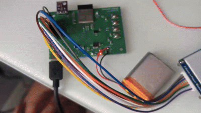
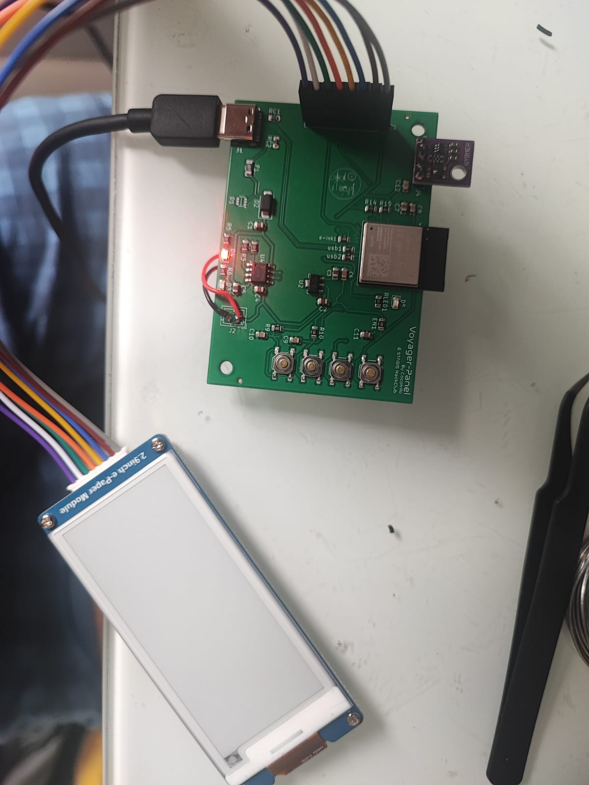
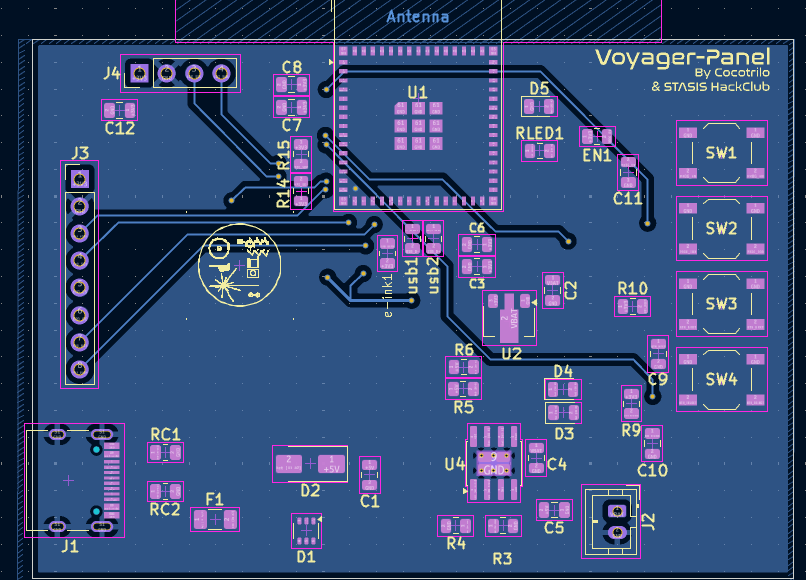
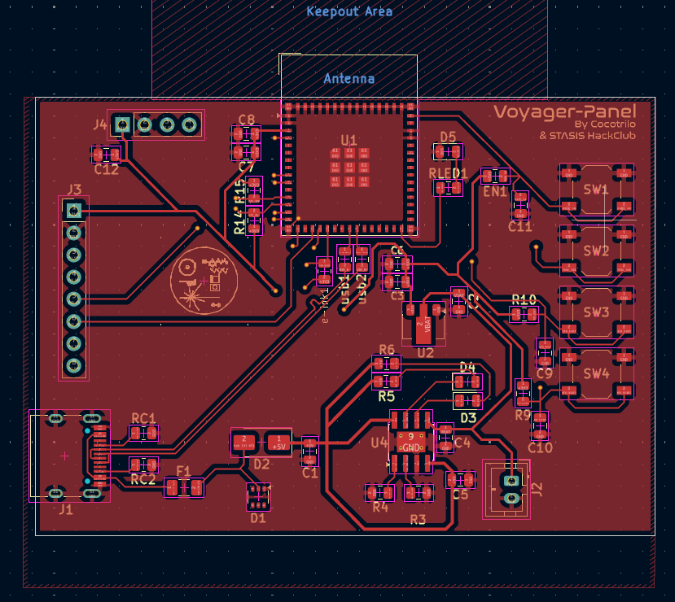
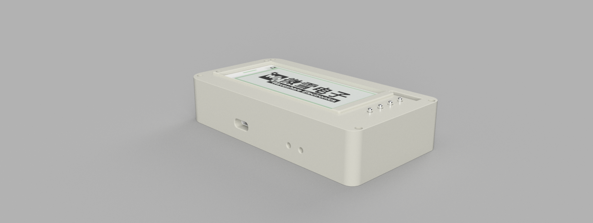

<div align="center">

# ⟡ VOYAGER PANEL ⟡

### An E-Ink travel dashboard





`ESP32-S3` · `296×128 E-Paper` · `Battery Powered` · `Wi-Fi` · `Low Power`

</div>

---

An E-Ink travel dashboard. with an ESP32-S3 Showing weather, hackclub countdowns, and travel info for hackactons. this dashboard has Low-Power consumption, Wi-Fi connected, battery-operated!!!!

---

## ⟡ The reason behind this project

This project started from the *dream* of always wanting to have a big countdown telling you the Narrow door for a better future is closing, yeah crazy right?, hahaha well actually this project started in the supermarket of my local city, I was shopping and noticed an E-Ink display, I thought *I have seen this before* and it was when I was searching my first project I saw something called E-Ink dashboard, and was cool but I thought Im too newbie for this, so I challenged myself to improve my PCB designer skills and I think I did a really cool project, im really proud of it tbh, well but in the end the actual big reason is to truly have a giant countdown telling you stasis is over in X days or telling you your youth days are over in X days I love presure >:D

---

## ⟡ Schematic Overview

<div align="center">


</div>

---

## ⟡ PCB — DIFFERENT VERSIONS

<div align="center">


</div>

<table>
<tr>
<td width="50%"></td>
<td width="50%"></td>
</tr>
<tr>
<td align="center"><b>Back copper</b></td>
<td align="center"><b>Front copper</b></td>
</tr>
</table>

---

## ⟡ RENDER!!

<div align="center">



</div>

<table>
<tr>
<td width="50%"></td>
<td width="50%"></td>
</tr>
<tr>
<td align="center"><b>Front</b></td>
<td align="center"><b>Back</b></td>
</tr>
</table>

---

## ⟡ Hardware at a glance

| | |
|---|---|
| **MCU** | ESP32-S3-MINI-1 — Wi-Fi, BLE, native USB |
| **Display** | Waveshare 2.9" e-Paper, 296×128, SSD1680 controller |
| **Sensor** | BMP280 over I2C — temperature, pressure, derived altitude |
| **Power** | 1000 mAh LiPo, TP4056 charger, MCP1700 LDO |
| **Protection** | TVS ESD array, Schottky reverse-current diode, 500 mA polyfuse |
| **Programming** | Native USB-C, no external UART bridge |

---

## ⟡ Firmware

Built with **PlatformIO** on the Arduino framework.

```
firmware/VoyagerPanelFirmware/
├── platformio.ini
└── src/
    ├── main.cpp
    └── images.h
```

Because the board uses the ESP32-S3's native USB and carries no USB-UART bridge,
`Serial` has to be routed to the USB CDC peripheral. Without these flags nothing
reaches the host:

```ini
build_flags =
    -D ARDUINO_USB_MODE=1
    -D ARDUINO_USB_CDC_ON_BOOT=1
```

The sensor and the display initialise **independently**, so a failure in one does not
take down the other. The dashboard degrades gracefully instead of hanging.

### Live telemetry

```
========== VOYAGER SENSOR ==========
  Temperature : 29.29 C
  Pressure    : 751.36 hPa
  Altitude    : 2452.2 m
====================================
```

---

## ⟡ Debugging log

The display refused to render, and tracking down why turned into the most interesting
part of this build — a full diagnosis of a hardware fault carried out **without a
multimeter**, using the microcontroller itself as the measuring instrument.

Short version: the SSD1680 was running on **phantom power**, leaking current through
its own ESD protection diodes. Enough to acknowledge a reset, not enough to execute a
single SPI command.

The full write-up, including the software continuity matrix used to prove it, lives in
**[DEBUGGING.md](DEBUGGING.md)**.

A second find along the way: the module sold as a BME280 is actually a **BMP280**. Its
chip ID register returns `0x58` instead of `0x60`, and it has no humidity channel. The
firmware reads that register and picks the right driver rather than trusting the label.

---

## ⟡ BOM

| Name | Purpose | Qty | Cost (USD) | Distributor |
|------|---------|-----|-----------|-------------|
| ESP32-S3-MINI-1 | Main microcontroller with WiFi and USB native | 1 | $8.50 | AliExpress |
| Waveshare 2.9inch e-Paper Module | Main e-ink display 296x128px | 1 | $17.00 | AliExpress |
| BME280 Breakout Module | Temperature/Humidity/Pressure sensor | 1 | $5.15 | AliExpress |
| LiPo Battery 1000mAh 3.7V | Portable power source | 1 | $5.00 | Local Ecuador |
| USB-C Receptacle 16P | Power input and native USB programming | 1 | $0.50 | JLCPCB |
| JST PH 2mm 2-Pin Connector | Battery connector | 1 | $0.10 | JLCPCB |
| Pin Header 1x08 2.54mm | E-ink display connector | 1 | $0.05 | Local |
| Pin Header 1x04 2.54mm | BME280 module connector | 1 | $0.05 | Local |
| TP4056-42-ESOP8 | LiPo battery charger IC | 1 | $0.15 | JLCPCB |
| MCP1700-3302 SOT-89 | 3.3V LDO regulator 0.2V dropout | 1 | $0.45 | JLCPCB |
| SP0503BAHTG SOT-363 | TVS ESD protection diode for USB | 1 | $0.20 | JLCPCB |
| SS14 SMA | Schottky diode reverse current protection | 1 | $0.05 | JLCPCB |
| Polyfuse 500mA 1206 | Resettable overcurrent fuse | 1 | $0.10 | JLCPCB |
| SW_SPST_TL3342 | Tactile buttons Reset/Boot/Next/Select | 4 | $0.05 | JLCPCB |
| LED 0805 Red | Battery charging indicator CHRG | 1 | $0.02 | JLCPCB |
| LED 0805 Blue | Standby indicator STDBY | 1 | $0.02 | JLCPCB |
| LED 0805 Green | System status indicator | 1 | $0.02 | JLCPCB |
| Resistor 1k 0805 | LED current limiting resistors | 3 | $0.03 | JLCPCB |
| Resistor 2.2k 0805 | TP4056 charge current set 550mA | 1 | $0.01 | JLCPCB |
| Resistor 4.7k 0805 | I2C SDA/SCL pull-up resistors | 2 | $0.02 | JLCPCB |
| Resistor 5.1k 0805 | USB-C CC1/CC2 pull-down resistors | 2 | $0.02 | JLCPCB |
| Resistor 10k 0805 | Pull-ups for EN/BOOT/UI buttons | 5 | $0.05 | JLCPCB |
| Resistor 27R 0805 | USB D+/D- series termination | 2 | $0.02 | JLCPCB |
| Capacitor 100nF 0805 | High frequency decoupling | 5 | $0.05 | JLCPCB |
| Capacitor 1uF 0805 | EN pin reset debounce | 1 | $0.02 | JLCPCB |
| Capacitor 10uF 0805 | Bulk decoupling capacitors | 5 | $0.15 | JLCPCB |
| Capacitor 22uF 0805 | ESP32 main power bulk decoupling | 1 | $0.05 | JLCPCB |
| PCB + SMT Assembly | 2-layer PCB with PCBA | 1 | $47.90 | JLCPCB |
| **TOTAL** | | | **$85.42** | |

---

## ⟡ Repository layout

```
├── cad/                          Fusion 360 enclosure + renders
├── docs/references/              Datasheets and reference material
├── firmware/
│   ├── VoyagerPanelFirmware/     PlatformIO project
│   └── diagnostics/              Hardware bring-up test sketches
├── images/                       Schematic, PCB, and build photos
├── projectFiles/
├── voyagerPanel/                 KiCad project
├── DEBUGGING.md
└── README.md
```

---

## ⟡ Final notes!

Thanks for reading! made possible with http://stasis.hackclub.com/

---

<div align="center">

## ⟡ me

*By cocotrilo*

**made with luv (THIS ONE was with a lot of love, EXCEPT FOR THE BOM PLEASE DONT USE EVER ALIEXPRESS) Nk but luv from EC <3**

</div>
